# BookStore

A desktop **BookStore application** built with **C#, .NET WPF, MVVM architecture, and Entity Framework Core**.  
This project implements the basic CRUD functionality needed to manage a small bookstore inventory with a clean, modern UI and solid business logic separation.

---

## 📌 About

BookStore is a **Windows desktop application** that lets users filter, add, edit, and delete books from an inventory.  
It’s designed using the **MVVM (Model-View-ViewModel)** pattern for clean separation of concerns and uses **Entity Framework Core** for data access and persistence.

---

## 🗂 Project Structure

```
📦BookStore/
├── 📁 BookStoreUI/        # UI Layer — WPF Views (XAML), ViewModels, Commands, Stores
├── 📁 BLL/                # Business Logic Layer — core logic and service classes
└── 📁 DLL/                # Data access layer — EF Core models & DbContext
```

---

## 🛠 Technologies Used

| Category | Technologies |
|----------|--------------|
| Language | C# |
| Framework | .NET (WPF) |
| Architecture | MVVM |
| ORM | Entity Framework Core |
| IDE | Visual Studio |
| Patterns | Repository Pattern, Dependency Injection |

---

## 📥 Getting Started

### 🔧 Prerequisites

- Visual Studio with **.NET Desktop Development** workload installed  
- .NET SDK supporting WPF  
- SQL Server / LocalDB 

### 📁 Installation

1. Clone the repository:
   ```
   git clone https://github.com/levtoshi/BookStore.git
   ```

2. Open the solution:
   - Open BookStoreUI.sln in Visual Studio.

3. Restore dependencies:
   - NuGet packages will be restored automatically.

4. Build and run:
   - Press **F5** or click **Run**.

---

## 🧠 Features

- 🔓 **Sign in** — User can sign in with login and password
- ➕ **Sign up** — User can sign up as admin or seller
- 📖 **Book Model** — Actions with book models with books list (admin only)
    - ➕ **Add books**  
    - ✏️ **Edit books**  
    - 🗑️ **Delete books**
    - ✨ **Add discount**
- 📦 **Book stock** — Actions with books in stock with books list
    - ➕ **Add books**
    - 🗑️ **Write off books** (admin only)
    - 💲 **Sell books**
    - 📌 **Add delay**
- 🔎 **Search books** — Actions with books filtering with books list
    - 📗 **Search by name, author, genre**
    - 🕐 **Sort by year**
    - 💲 **Sort by sales**
- ✨ **Discounts** — List of dicounts
    - 🗑️ **Delete discount**
- 📌 **Delays** — List of delays
    - 🗑️ **Delete delay**
- 📖 **Account** — Account settings
    - ✏️ **Change login**
    - 🔑 **Change password**

---

## 📈 Architecture Overview

The application follows the **MVVM pattern**:

- **Model** — Entity classes and database models  
- **ViewModel** — Logic for UI interaction and data binding  
- **View** — WPF XAML user interface

Entity Framework Core handles database operations and ensures clean data access abstraction.

---

## 🖼️ Screenshots

### Book Model Part
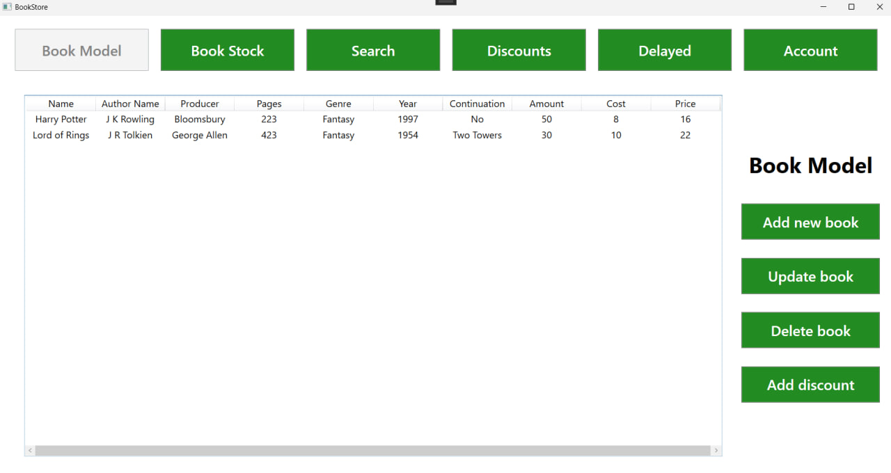

### Add new book form
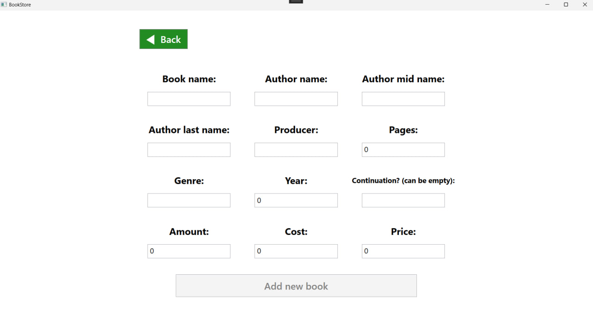

### Update book form (auto filled)
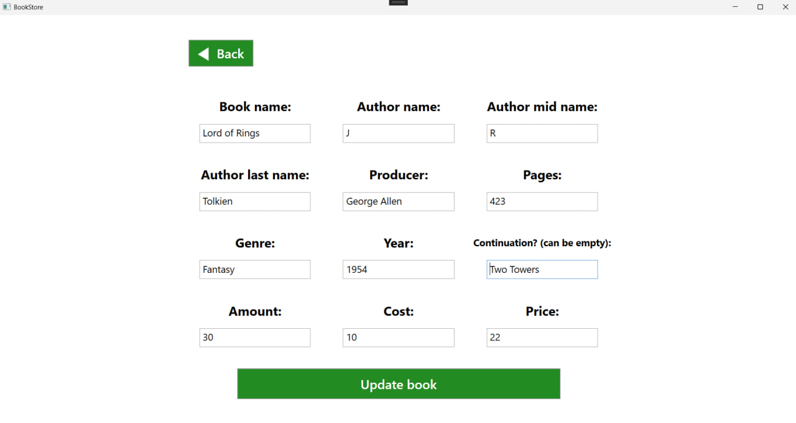

### Add discount for book
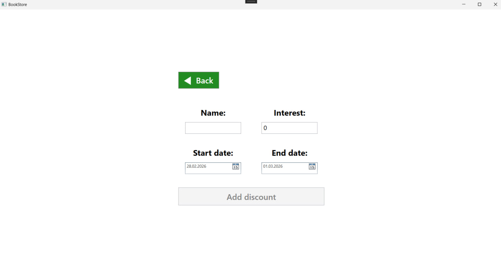

### Book Stock Part
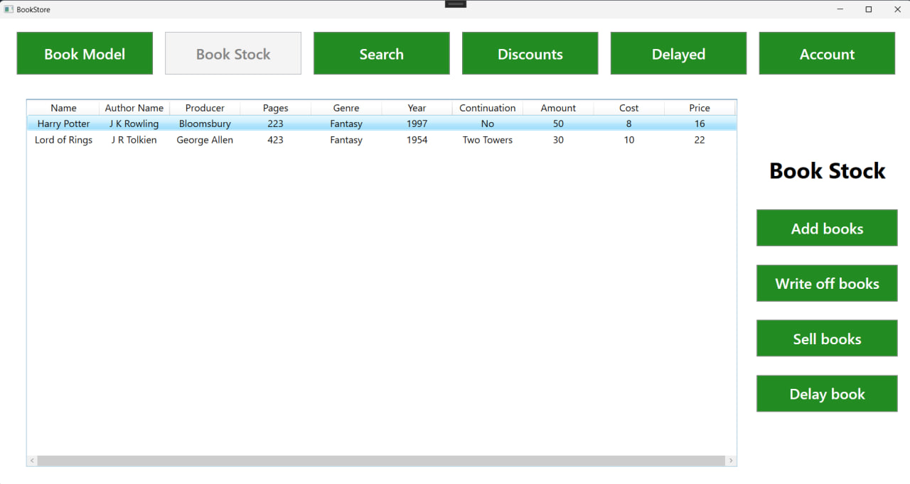

### Add / Write off book stock panel
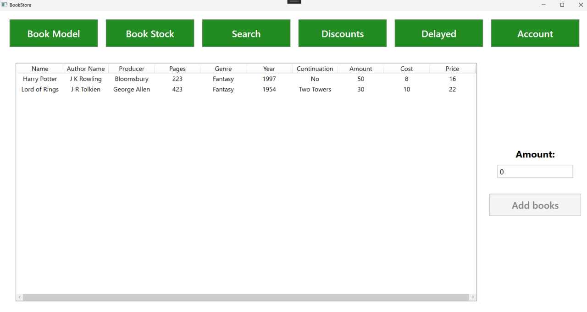

### Sell book
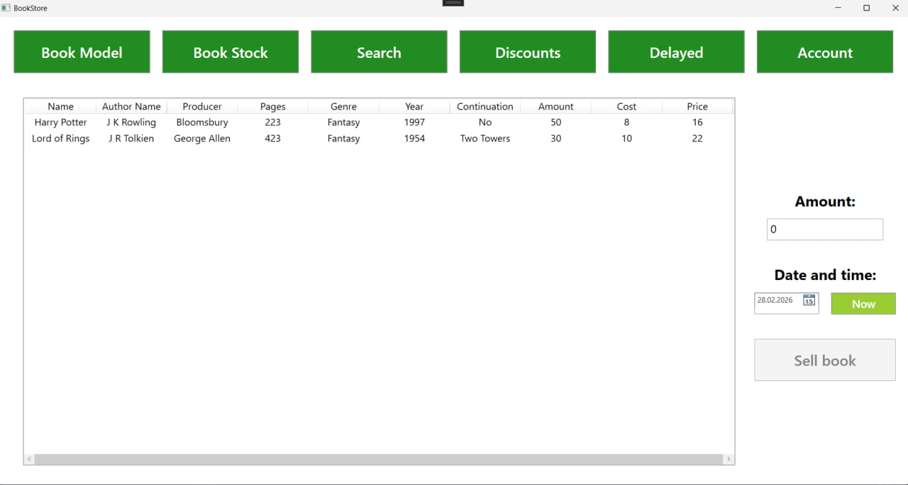

### Add delay for book
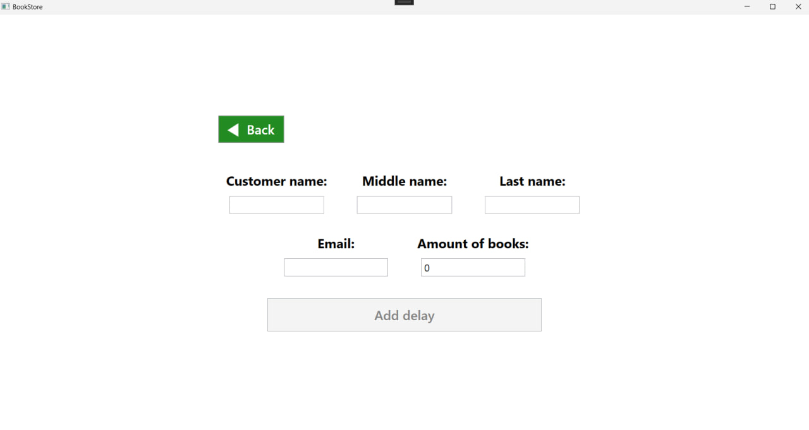

### Search Part
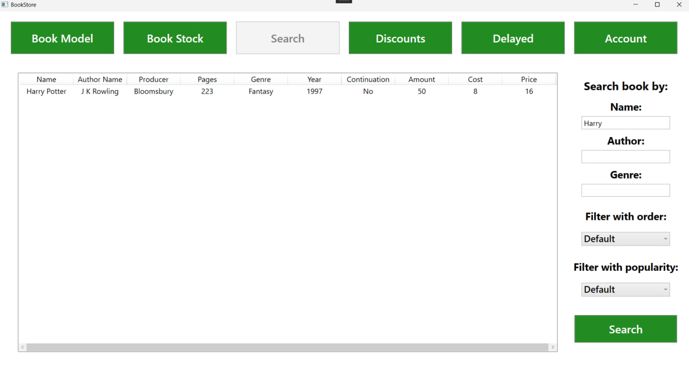

### Discounts
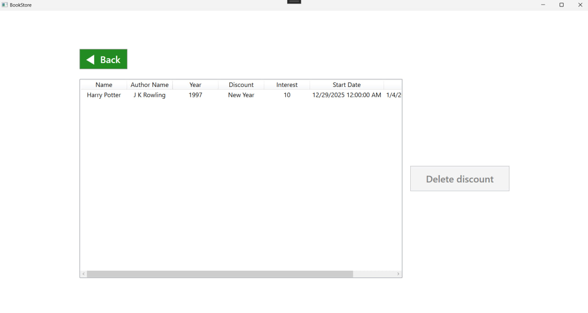

### Delays
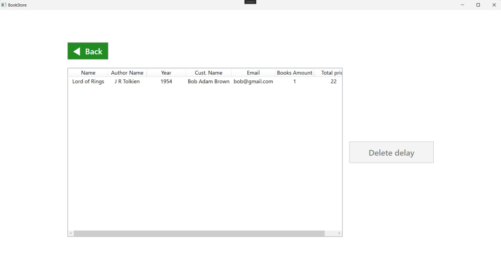

### Sign in form
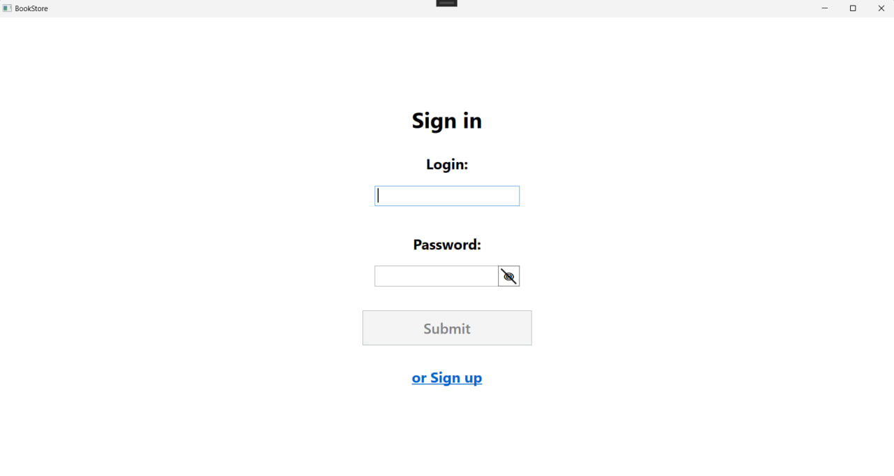

### Sign up form
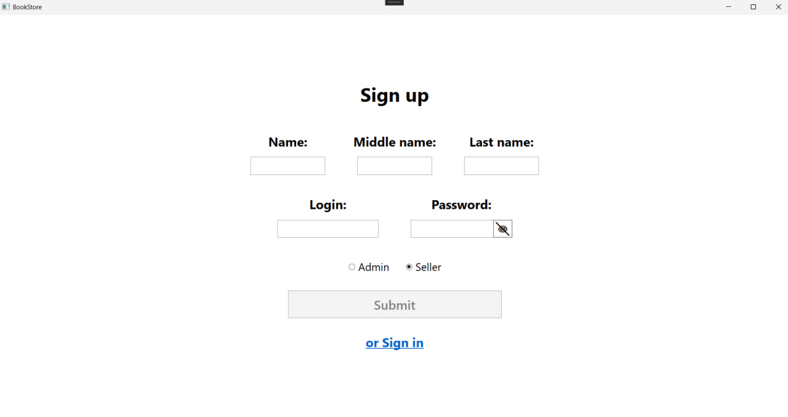

### Account setting
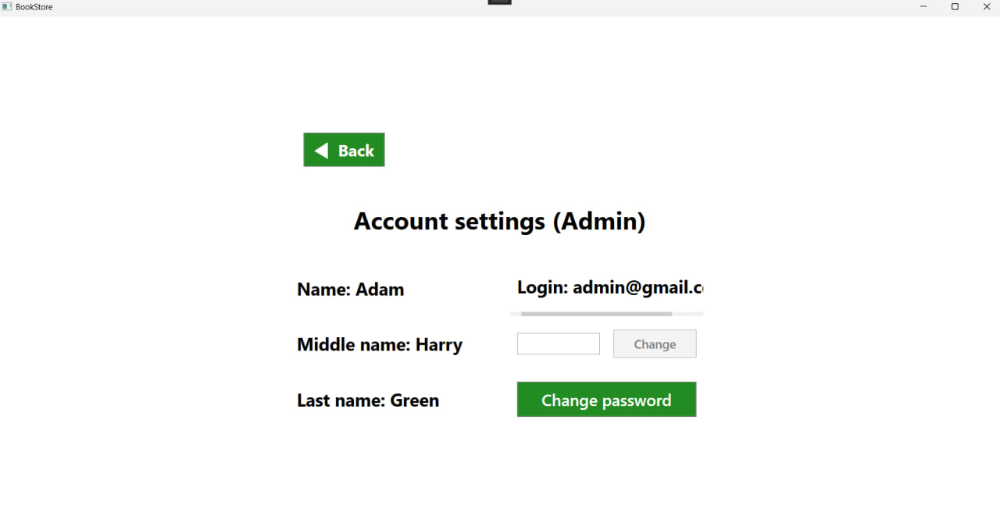

### Change password form
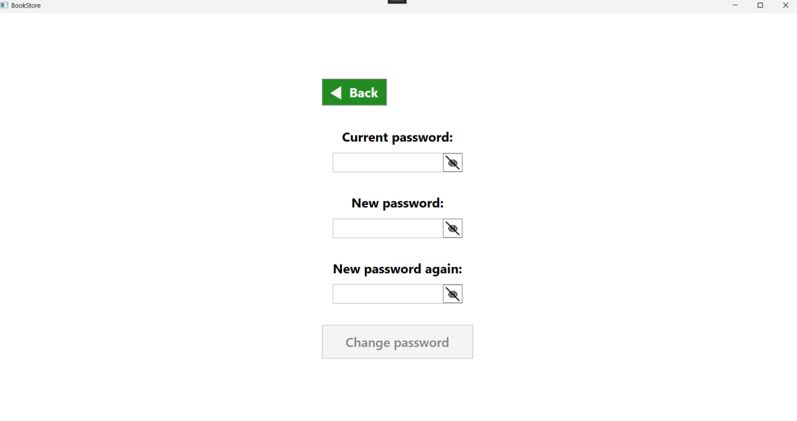